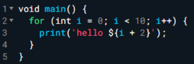
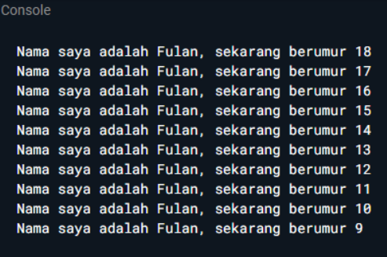
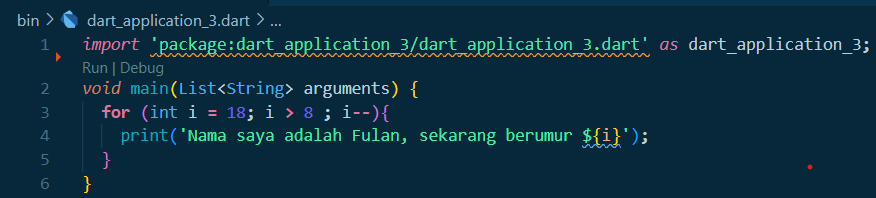
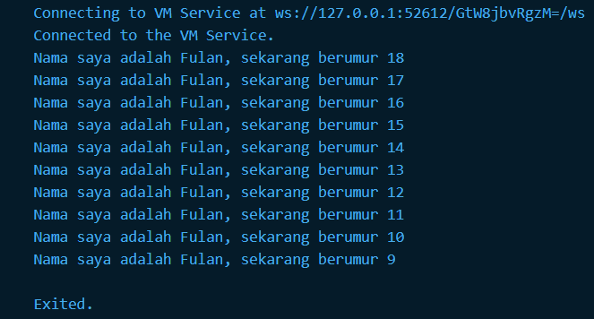

# Laporan Jobsheet 1 Pemrograman Mobile
- Nama  : Moch. Nadhif Alkautsar
- NIM   : 2241760067
- Kelas : SIB 3D
- Absen : 20

## Soal 1
Modifikasilah kode pada baris 3 di VS Code atau Editor Code favorit Anda berikut ini agar mendapatkan keluaran (output) sesuai yang diminta

Output yang diminta:

### Jawaban

## Soal 2
Mengapa sangat penting untuk memahami bahasa pemrograman Dart sebelum kita menggunakan framework Flutter ? Jelaskan!

### Jawaban 
Karena bahasa yang digunakan pada framework flutter adalah bahasa pemrograman dart, sehingga perlu mengetahui dasar dasarnya terlebih dahulu sebelum melakukan dengan menggunakan framework flutter

## Soal 3
Rangkumlah materi dari codelab ini menjadi poin-poin penting yang dapat Anda gunakan untuk membantu proses pengembangan aplikasi mobile menggunakan framework Flutter.

### Jawaban
Bahasa Dart adalah inti dari framework Flutter yang akan menjadi dasar untuk bekerja. Pengembang perlu mengetahui asal-usuk bahasa Dart dan lain-lain. Sehingga memiliki pemahaman dasar yang kuat tentang Dart akan memudahkan untuk menjadi lebih produktif dengan Flutter dan merasa nyaman menggunakan Flutter.

Dart diluncurkan pada tahun 2011 dan merilis versi stabilnya pada tahun 2013 yang dimana awalnya berfokus pada pengembangan web dan sekarang berubah berfokus pada mobile development.Sebenarnya tujuan utam Dart adalah untuk menggantikan javascript. Dart mencoba memecahkan masalah pada javascript karena tidak tersedianya ketahanan seperti bahasa lain, menawarkan performa terbaik dan alat yang lebih baik untuk proyek skala besar, dan dibentuk agar kuat dan fleksibel.

Dart dapat dieksekusi dengan dua cara yaitu:
* Dart virtual machines (VMs)
* JavaScript compilations

Tentunya eksekusi dapat berlangsung pada lingkungan yang mendukung bahasa dart dan perlu memperhatikan fitur-fitur berikut:
* Runtime systems
* Dart core libraries
* Garbage collectors

Eksekusi beroperasi dalam dua mode yaitu:
* kompilasi **Just In Time(JIT)** adalah tempat kode sumber kompilasi sesuai kebutuhan
* kompilasi ** Ahead Of Time** adalah dimana Dart VM dan kode anda dikompilasi sebelumnya, yang meneyediakan _garbage collector_ dan metode-metode native dari Dart **software development kit** pada aplikasi